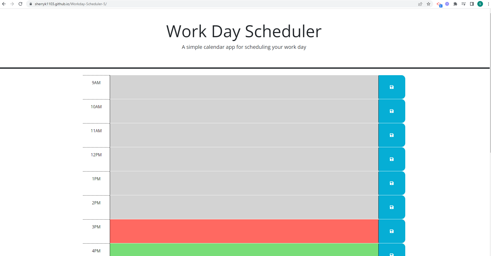

# Workday-Scheduler-5

## Description

I wanted to create a web application where I can schedule my day down to the hour. As a busy and stressed out bootcamp student with a full time job it is important to ensure that I balance social life, my full time job, bootcamp, and other responsibilities and this web application helps me do so.

## Installation

To install code, run the following command:
Git clone <paste SSH key>

## Deployed Link

https://sherryk1103.github.io/Workday-Scheduler/

## Usage

## Process Steps

1. Created variables
2. Added Click Event Listeners
3. Added Dayjs to manipulate dates and times
